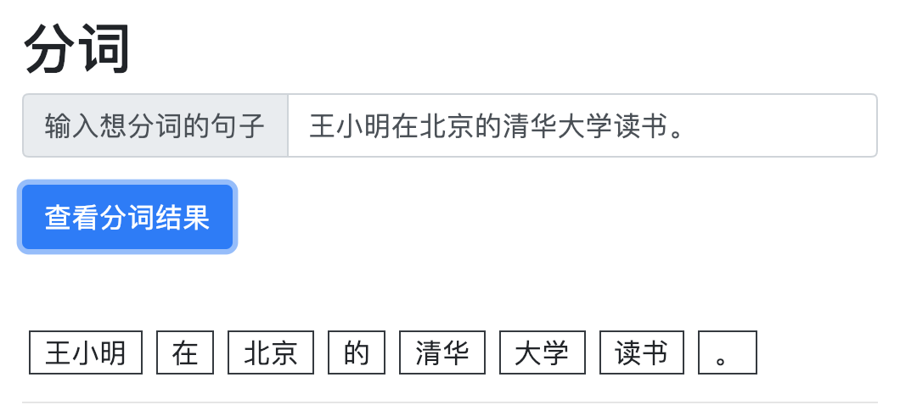

# PaddleTokenizer

使用 PaddlePaddle 实现基于深度神经网络的中文分词引擎



## 神经网络结构
BiLSTM+CRF


## 环境要求
Python 3.5+

## 安装依赖
```bash
pip install -r ./requirements.txt
```

## 预训练模型
下载 release 中的模型文件，解压缩后将目录 `test.inference.model` 放置到本项目的根目录下即可。

## 本地训练模型

### 下载数据

见 [人民日报语料处理工具集](https://github.com/howl-anderson/tools_for_corpus_of_people_daily)，将 conll 格式的 `train.txt` 和 `test.txt` 放到 `data` 目录下。

### 训练

```bash
python -m paddle_tokenizer.train
```

在 2017 款 MacBook Pro (2.5 GHz Intel Core i7) 上训练耗时约十分钟。 

## 命令行使用 

``` python
from paddle_tokenizer.server import server

result = server("王小明在北京的清华大学读书。")
print(result)
```

输出：

``` text
['王', '小明', '在', '北京', '的', '清华', '大学', '读书', '。']
```


## 本地推理 Demo

为了更好的展现推理效果，本项目将 PaddleTokenizer 做成了 Server+Browser 的 demo 形式

### 启动 PaddleTokenizer 的 HTTP 服务器

```bash
python ./http_server.py
```

将会在在 `localhost:5000` 启动一个 HTTP 服务器，用户可以通过该 HTTP 端口使用 PaddleTokenizer，注意该网址只提供 API 不提供界面。

### 启动前端服务器

```bash
bash ./UI.sh
```

将会在 `localhost:8000` 启动前端服务器，用户可以访问该网址，

### 访问前端页面

打开页面：http://127.0.0.1:8000 即可，效果如下:


### LICENSE

AGPL-3.0
