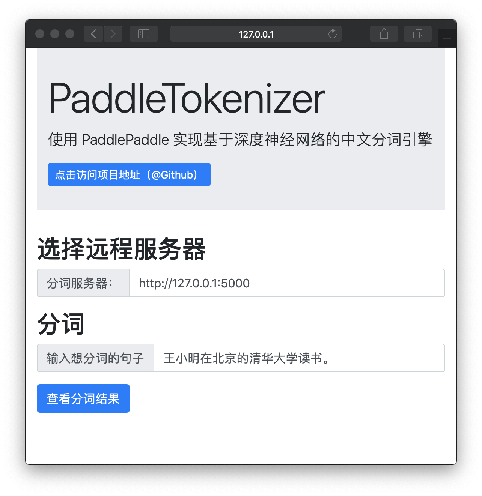

# PaddleTokenizer

使用 PaddlePaddle 实现基于深度神经网络的中文分词引擎


## 环境要求
Python 3.5+

## 安装依赖
```bash
pip install -r ./requirements.txt
```

## 下载预训练模型
下载 release 中的模型文件，解压缩后将目录 `test.inference.model` 放置到本项目的根目录下即可。

## 除了下载预训练模型外，还可以本地训练模型
### 下载数据
见 [人民日报语料处理工具集](https://github.com/howl-anderson/tools_for_corpus_of_people_daily)，将 `train.txt` 和 `test.txt` 放到 `data` 目录下。

### 训练
```bash
python ./train.py
```

在 2017 款 MacBook Pro (2.5 GHz Intel Core i7) 上训练耗时约十分钟。 

## 启动 HTTP 服务器
```bash
python ./http_server.py
```

将会在在 `localhost:5000` 启动一个 HTTP 服务器

## 启动前端
```bash
bbash ./UI.sh
```

将会在 `localhost:8000` 启动前端服务器

## 访问前端页面
打开页面：http://127.0.0.1:8000 即可，效果如下:

